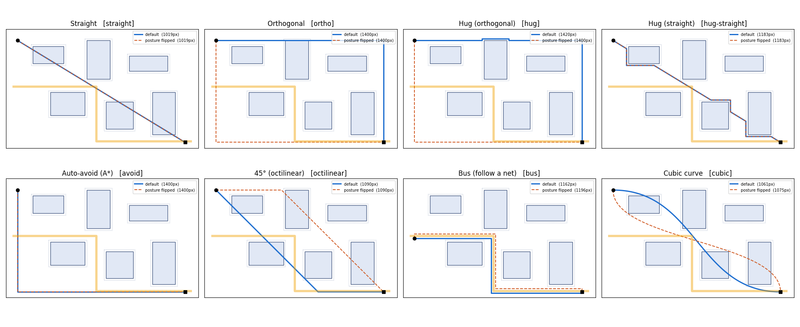
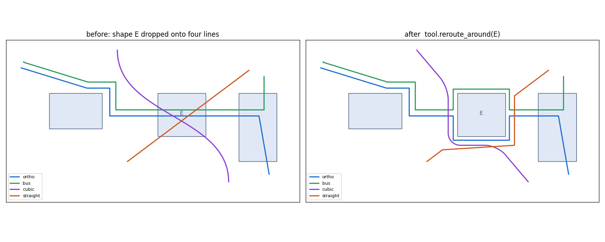
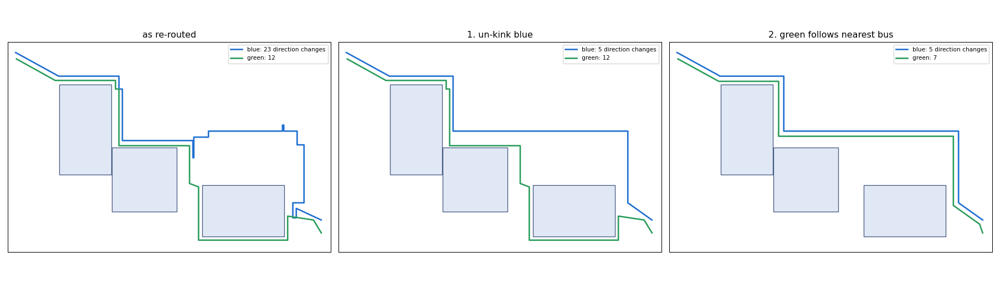
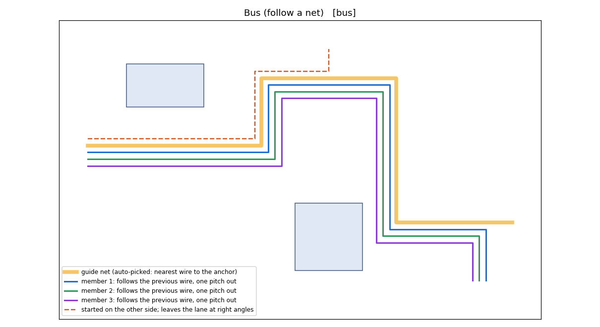

# smartline

[](https://github.com/pjm4github/smartline/actions/workflows/ci.yml)

Smart rubber-band line drawing for `QGraphicsScene`, for **PyQt6, PySide6, PyQt5 and
PySide2**. Click an anchor, move the mouse, and the preview is produced by a pluggable
*router*: straight, orthogonal with a toggleable posture, obstacle-hugging, optimal
obstacle-avoiding, 45° octilinear, bus-following, and cubic curves. The routing core is
pure Python with no dependencies, so the same routers work headless (netlist importers,
round-trippers, tests).



*Blue = default posture, dashed orange = posture flipped, amber = an existing net (the bus
guide). Generated by `python tools/gallery.py`.*

## Install

```
pip install git+https://github.com/pjm4github/smartline          # until it is on PyPI
pip install "smartline[pyqt6]"      # or [pyside6] / [pyqt5] / [pyside2] to pull a binding too
```

smartline has **no hard Qt dependency**: it uses the binding your application has already
imported, then `QT_API`, then the first one installed.

## Quick start

```python
from smartline import SmartLineTool

tool = SmartLineTool(scene, modes=["ortho", "hug", "bus", "cubic"])   # any QGraphicsScene
tool.corner_radius = 8
tool.grid = 10
tool.routeFinished.connect(lambda route: print(route.to_svg()))
tool.set_active(True)
```

`python app.py` opens the PyQt6 **test bench**: every mode, all tuning knobs, ports to snap
to, movable shapes, clearance-hull overlay and a live read-out of each route.
`python examples/demo.py` is the minimal, binding-agnostic embedding example.

| Input | Action (`tool.keymap` is an editable dict) |
|---|---|
| left click | set anchor / commit the previewed leg |
| double-click, Enter | commit and finish |
| right click | finish at the last committed point |
| Space or `/` | **toggle posture** (HV ↔ VH, bus side, curve tangents …) |
| Shift+Space or M | next mode (Shift+M previous); `1`…`9` pick a mode |
| G | bus mode: cycle the guide net |
| Backspace / Esc | undo last leg / cancel |
| Shift (held) | constrain straight legs to 45° steps |

## Modes

| name | class | what it does |
|---|---|---|
| `straight` | `StraightRouter` | rubber band, optional angle snap |
| `ortho` | `OrthoRouter("L")` | Manhattan elbow; posture latched from the drag direction, Space flips it |
| `ortho-alternate` | `OrthoRouter("alternate")` | one H/V segment per click (PictoSync's current ORTHOCURVE behaviour) |
| `hug` / `hug-straight` | `HugRouter(base)` | **walkaround**: spans that would pierce a shape slide around its clearance hull, shorter way round. Wraps *any* router. |
| `avoid` | `AvoidRouter` | orthogonal visibility grid + A* on (node, heading), cost = length + bend penalty × bends |
| `octilinear` | `OctilinearRouter` | 45° diagonal + axis run |
| `bus` | `BusRouter` | follow an existing net at a fixed pitch (mitered offset curve) |
| `cubic` / `cubic-hug` | `CubicRouter(base)` | cubic Bézier connector: S-curve for two points, corner blends (or Catmull-Rom) over any skeleton router |

Shapes containing the anchor or the cursor never repel the line, so ports work naturally.

## Editing finished lines

Drawing and editing are separate classes in the same package, sharing the `Route` model:
`SmartLineTool` *produces* a Route, `RouteEditor` *reshapes* one, and the pure-Python
`smartline.edit` functions underneath do the geometry (so they are usable headless too).

```python
from smartline import RouteEditor

editor = RouteEditor(scene)                       # event filter, like the tool
editor.routeEdited.connect(lambda item, old, new: undo_stack.push(MyCmd(item, old, new)))
editor.set_active(True)                           # edits whichever single connector is selected
```

| handle | what it does |
|---|---|
| square (anchor) | move a vertex. Orthogonal routes stay orthogonal: neighbours slide on their axes; Shift frees it |
| bar (section grip) | move a whole straight section perpendicular to itself; a section touching a pinned end grows a jog rather than pulling the end off its port |
| circle (control point) | bend a cubic. A thin **tangent line** joins it to its anchor. The partner handle across the anchor stays collinear (`aligned`); Ctrl = `mirrored` lengths; Alt = `free` (cusp) |

Double-click the line to add a vertex, double-click a vertex (or Delete) to remove it,
`C` / `L` turns the section under the cursor into a cubic / a line, Esc abandons a drag.
Clicks that do not land on a handle pass straight through, so selection and moving still work.

Integration points mirror the tool: `editor.apply(item, route)` pushes a route back into
*your* item class (default: `setPath` on a `QGraphicsPathItem`), `editor.route_of(item)` says
where an item keeps its route, `snap_provider` re-snaps dragged ends to ports, and
`routeEdited(item, old, new)` fires once per gesture for undo. Headless:
`edit.move_segment`, `move_anchor`, `move_control`, `insert_anchor`, `delete_anchor`,
`convert_segment`, `normalize`, `handles`, `nearest_segment` - all `Route -> Route`.

## Re-routing lines around a moved shape

```python
changes = tool.reroute_around(shape_item)      # or a QRectF; -> [(item, old_route, new_route), ...]
tool.reroute_colliding()                       # the same, for every shape in the scene
```



Call it when a shape has been dropped onto existing lines (the bench does it on drop and
on `R`). For each line that passes through the shape:

* only the offending part is replaced - the span is widened to the nearest vertices outside
  the shape's clearance hull and re-routed between them, so the rest of the line and any
  manual edits survive (curved legs are redone whole, because their vertices come from
  smoothing rather than from the user);
* that part is routed with **the method it was drawn with**. Every leg records its mode,
  posture and flip in `Route.legs()`, so a line drawn half `straight`, half `ortho` is
  repaired leg by leg. Non-avoiding modes are used through `Router.avoiding()` - the same
  style plus a walkaround pass - so `ortho` stays orthogonal, `cubic` stays a curve,
  `straight` gets a minimal detour, and `hug` / `avoid` / `bus` are used as they are;
* **lines avoid each other, not just the shape.** Lines are repaired one after another and
  each sees the ones already done. A new piece may *cross* another line but may not run
  *along* one (closer than half of `tool.wire_spacing`, default 10 px): if it would, the same
  routing method is run again one lane further out - every hull pushed out by another
  `wire_spacing` - until the piece has a track of its own, so detours nest like a bus.
  Lines are cut exactly where they enter and leave the lane's hull, which keeps the repair
  local and gives each lane its own entry and exit. Free-angle methods (`straight`) are then
  pulled taut, corner to corner; `ortho`/`avoid` stay rectilinear, `octilinear` keeps 45°.
  `route.meta["overlaps"]` reports shared track if no free lane was found in 8 tries;
* the batch is returned and emitted as `routesRerouted` for a single undo step. If a line
  cannot be cleared (an end lies inside the shape) the best attempt is returned with
  `route.meta["unresolved"] = True`.

Hooks mirror the editor: `tool.route_of(item)` and `tool.apply_route(item, route)`.
Headless: `smartline.reroute.repair(route, rect, ctx, lookup)`, `hits`, `hit_segments`.

It deliberately does **not** move line ends that are attached to the shape - keeping a wire
glued to a port is connection tracking, which belongs to the application's model.

## Tidying a line: un-kink and follow-bus



```python
tool.unkink(item)                 # -> [(item, old, new)]   (empty if the line was clean)
tool.follow_bus(item)             # follow the line it runs closest to;  follow_bus(item, guide=other)
```

**Un-kink.** A kink is three changes of direction within `tool.kink_length` (40 px). The two
bends that are closest together are the ends of one short section, so that section is
collapsed: one of the runs it joins is slid sideways onto the other, which removes both
bends - a short jog becomes a straight run, a hairpin or spur folds onto itself and vanishes.
Shortest sections go first, repeatedly, until none is left. A move is refused if it would
shift a line end, cut further into a shape's clearance, or slide the run onto another line,
so a step that exists *because* of a shape survives. Free-angle lines drop the kink's
vertices instead. `reroute_around` un-kinks its results automatically (`tool.tidy_reroutes`).

**Follow bus.** The guide is the other line this one is closest to *on average over its whole
length* (`tidy.nearest_route`), so a line that merely starts near yours does not win. The
line keeps its own end points and is re-routed as a bus member of the guide: parallel at
`bus_pitch`, on the side it already mostly runs, in the first lane no other line occupies,
around shapes, then un-kinked. Its provenance becomes `bus`, so later re-routes keep it a bus.

Headless: `smartline.tidy.unkink(route, ctx, max_jog, others)`, `kinks`, `nearest_route`, `follow`.

## The framework: one contract, three extension points

```
            start, end, RouteContext
                      │
        ┌─────────────▼──────────────┐
        │ Router.route()  → skeleton │  polyline [(x, y), …]   wrappers, obstacle tests, bus guides
        │ Router.shape()  → Route    │  L / Q / C segments      what is drawn and handed to the app
        └─────────────┬──────────────┘
                      │ Route
   ┌──────────────────┼───────────────────────────┬─────────────────────┐
 route_to_path()   to_nodes(normalize, hv)     to_segments()         to_svg()
 QPainterPath      PictoSync curve nodes       KiCad wires           debugging / SVG
```

**1. Routers are stateless strategies.** Everything interactive (flip, latched posture,
previous heading, obstacles, guides, pitch…) arrives in `RouteContext`. A polyline router
implements only `route()`; `shape()` defaults to straight segments. A curve router overrides
`shape()` and lets `route()` return the flattened curve, so it still composes with wrappers.

**2. `Route` is the single result type.** Apps never parse router internals; they take the
view they need. `Route.to_nodes()` emits exactly the `{"cmd", "x", "y", "c1x", …}` schema
of PictoSync's `MetaCurveItem`, including `normalize=True` (0–1 within `bbox()`) and
`hv=True` for orthocurves. `to_segments()` gives two-point wires for KiCad.

**3. The registry decides what a mode name means.**

```python
import smartline as sl

@sl.register                                  # add a mode
class Tee(sl.Router):
    name, label = "tee", "T-junction"
    def route(self, start, end, ctx): ...

@sl.register(replace=True)                    # take over a built-in - explicit, never silent
class PictoCubic(sl.CubicRouter):             # keeps the name "cubic"
    def smooth(self, skeleton, ctx) -> sl.Route:
        ...                                   # PictoSync's own cubic logic

sl.register("hug45", lambda: sl.HugRouter(sl.OctilinearRouter()))   # compose via a factory
```

Packages can also contribute modes without being imported, through the
`smartline.routers` entry-point group (see `pyproject.toml`).

### The cubic placeholder

`CubicRouter` is a working default *and* the seam for PictoSync's curve modality:
`smooth(skeleton, ctx) -> Route` is the only method to override. The skeleton comes from
whichever base router you compose it with (`StraightRouter` by default; a hugging or
avoiding base keeps the curve clear of shapes - blend radius is capped at 3 × clearance for
that reason). Tangent direction follows the same posture logic as `ortho`, so Space flips it.

### Tool-level customisation, lightest first

| need | mechanism |
|---|---|
| spacing, pens, grid, keys | attributes: `clearance`, `grid`, `corner_radius`, `bus_pitch`, `pen`, `keymap` … |
| ports / pins | `snap_provider(QPointF) -> QPointF or None` (wins over grid and lane snapping) |
| what is an obstacle / a net | `obstacle_filter`, `obstacle_provider`, `guide_provider` |
| your own connector item | `item_factory(route) -> QGraphicsItem`, or `auto_add = False` and handle `routeFinished` |
| anything deeper | subclass and override `make_item`, `collect_obstacles`, `collect_guides` |

### Recipe: PictoSync

```python
tool = SmartLineTool(scene, modes=["ortho-alternate", "hug", "bus", "cubic"])
tool.snap_provider = lambda p: port.mapToScene(QPointF(0, 0)) if (port := _find_nearby_port(scene, p)) else None
tool.obstacle_filter = lambda it: hasattr(it, "ann_id") and it.kind not in ("line", "curve", "orthocurve")

def make_curve(route):
    l, t, r, b = route.bbox()
    ortho = route.is_polyline and all(n["cmd"] in "MHV" for n in route.to_nodes(hv=True))
    cls = MetaOrthoCurveItem if ortho else MetaCurveItem
    return cls(l, t, r - l, b - t, route.to_nodes(normalize=True, hv=ortho), scene._make_id(), scene._on_item_changed)
tool.item_factory = make_curve
```

The tool is an event filter, so `AnnotatorScene`'s own mouse handlers need no changes;
activate it from your `Mode` enum with `tool.set_active(mode == Mode.SMARTLINE)`.

### Recipe: KiCad round-tripper

```python
from smartline import RouteContext, create          # no Qt needed

ctx = RouteContext(obstacles=symbol_bboxes, clearance=50, bus_pitch=100, guides=existing_wires)  # mils
wires = create("avoid").shape(pin_a, pin_b, ctx).to_segments()       # [(p0, p1), …] -> (wire (pts …))
```

Interactive: `tool.grid = 50` (mils) keeps every vertex on the schematic grid, and
`modes=["ortho", "hug", "avoid", "bus"]` leaves out the curve modes KiCad cannot store.

## Bus mode — hugging another net



* **Which net is mimicked?** By default the wire *nearest to the anchor click*, if it is
  within `tool.bus_capture` (60 px). It is highlighted in amber while you draw. `G` steps
  through the other nets (nearest first) and then back to automatic. Programmatically:
  `RouteContext.guide` (explicit) or `RouteContext.guides` (auto-pick).
* **What counts as a net?** Everything the tool has drawn, plus `QGraphicsLineItem`s and
  unfilled `QGraphicsPathItem`s in the scene. Supply `tool.guide_provider = lambda: [[QPointF, …], …]`
  to feed your own model (e.g. PictoSync line / curve / orthocurve items).
* **Side and lane.** The new wire runs on the side of the guide where you clicked; Space
  flips it to the other side. The lane number is `round(distance / bus_pitch)`, so clicking
  next to the outermost member gives the next lane, and an anchor within half a pitch of a
  lane is pulled onto it (a port snap always wins over this).
* **Geometry.** The lane is the mitered *parallel (offset) curve* of the guide — inner
  corners shorten, outer corners lengthen, spacing is exact through bends; segments too
  short to survive the offset are dropped instead of folding back. The route is
  anchor → lane → along the lane to the point nearest the cursor → right-angle exit to the
  cursor (or straight on, past the end of the guide). Travel in either direction.
* **Fallbacks.** No net in range → behaves like `hug`. Shapes in the lane's way → the same
  walkaround pass as `hug` (`BusRouter(hug_obstacles=False)` disables it).
* **Known limit.** The walkaround pass knows shapes, not wires: where a shape squeezes the
  lane, the detour can close up on a neighbouring bus member. Treating finished wires as
  thin obstacles (or a push-and-shove pass) is the fix.

## Layout

```
src/smartline/
  geometry.py   clipping, hull walk, offset curves, snaps            (pure Python)
  route.py      Route / Seg result type and its views                (pure Python)
  routers.py    RouteContext + router strategies                     (pure Python)
  registry.py   register / create / default_routers / plugins        (pure Python)
  qt_compat.py  binding shim
  edit.py       Route -> Route editing operations, handles, hit-testing   (pure Python)
  tidy.py       un-kink a line; make it follow another as a bus member                   (pure Python)
  reroute.py    repair a Route around a shape using each leg's original method    (pure Python)
  tool.py       SmartLineTool (draw, reroute_around), route_to_path, keymap
  editor.py     RouteEditor: handles overlay, drag / insert / delete / convert
tests/          core + framework tests (no Qt) and tool tests (real Qt, or a stub without it)
app.py (PyQt6 test bench)   examples/demo.py   tools/gallery.py   .github/workflows/ci.yml
```

## Tests

```
pip install -e ".[pyqt6,test]" && python -m pytest        # python run_tests.py works without pytest
```

CI runs the suite without Qt, then on PyQt6 / PySide6 / PyQt5 × Windows / Linux × Python
3.9 / 3.12 with `QT_QPA_PLATFORM=offscreen`, smoke-tests the demo window, and builds the wheel.

**Verified** (CI run 35478235336): all tests and the demo smoke test pass on PyQt5, PyQt6 and
PySide6 × Windows / Linux × Python 3.9 / 3.12, plus the Qt-free core job and the wheel build.
PySide2 is supported by the shim but not in the CI matrix (no wheels for current Pythons).

**Binding notes learned from CI.** Obstacle hulls come from `sceneBoundingRect()`, which
includes half the shape's pen width - a 1 px outline moves the hull by 0.5 px. On PySide, keep
Python references to items you add to a scene (as you would anyway in a real application).

## Related packages (PyPI survey, Sept 2026)

Nothing on PyPI offers an interactive, embeddable line tool for Qt. Nearest neighbours:
node-editor *frameworks* that own the scene (`NodeGraphQt`, `OdenGraphQt`, `qtpynodeeditor`,
`SpatialNode`); batch orthogonal routers without interaction (`pyorthogonalrouting`);
and layout engines (`hola-graph`, a pybind11 wrapper over Adaptagrams/libavoid's sibling
HOLA; `orthogonal`). `pyqtgraph` has no connector routing.

## Literature and prior art

**Rubber-banding.** The interaction itself — anchor, live preview that follows the
cursor, commit on click — goes back to Sutherland's *Sketchpad* (1963) and is the
standard "rubber-band line" of interactive graphics texts (Foley & van Dam).

**Posture-toggled orthogonal wiring.** Schematic editors constrain each leg to an "L"
with a user-flippable *posture*. KiCad's schematic editor exposes free-angle / 90° / 45°
line modes cycled with Shift+Space, `/` to switch posture, Backspace to drop the last
segment, and pin snapping that overrides the grid — the model adopted here. Altium,
OrCAD and Cadence Virtuoso wire tools behave the same way (Space / Shift+Space there).

**Hugging = walkaround.** KiCad's interactive PCB router (Włostowski's push-and-shove,
`PNS::WALKAROUND`) handles a colliding head by walking it around the obstacle's *hull*
(the obstacle inflated by the clearance), trying clockwise and counter-clockwise
policies, keeping the shorter, and capping iterations. The same boundary-following idea
is the *Bug* family of robot path planners (Lumelsky & Stepanov 1987). `HugRouter` is
that algorithm on rectangular hulls, applied to the whole previewed polyline so that an
elbow that lands inside a shape is handled too.

**Optimal obstacle-avoiding orthogonal routing.** Wybrow, Marriott & Stuckey,
*Orthogonal Connector Routing* (Graph Drawing 2009) — the algorithm in **libavoid**
(Inkscape, Dunnart, and JointJS's libavoid demo): (1) build an *orthogonal visibility
graph* from shape corners and connection points, (2) A* over (node, entry direction)
minimising `length + penalty × bends` with a bends-remaining heuristic, (3) a *nudging*
pass that orders and separates connectors sharing a channel. `AvoidRouter` implements
(1)–(2) (using the full grid through hull edges, a superset of the OVG that yields the same
optimal routes); (3) only matters once many finished connectors share channels and is the
natural next step. Follow-ups: *Incremental Connector Routing* (GD 2005, polyline
visibility graphs with incremental updates), *Orthogonal Hyperedge Routing* (2012) and
*Seeing Around Corners: Fast Orthogonal Connector Routing* (2014), which prunes the graph
to 1-bend visibility for large speed-ups.

**Bus / follow routing = offset curves.** Running a wire parallel to an existing one is
the polyline *offset (parallel) curve* problem of CAD: offset each segment along its normal,
re-join neighbours with miters, and discard segments that invert on the inside of tight
corners (Tiller & Hanson, *Offsets of Two-Dimensional Profiles*, IEEE CG&A 1984; the same
construction underlies stroke expansion in 2-D renderers). `geometry.offset_polyline` is that
construction for open polylines; `BusRouter` adds guide picking, lane numbering and the
entry/exit jogs.

**Grid / maze and line-search routers (EDA heritage).** Lee's maze router (1961) finds a
shortest path by BFS wave expansion on a grid; Hadlock (1977) and Soukup (1978) add
detour-number and goal-directed search; Mikami–Tabuchi (1968) and Hightower (1969)
replace cells with *line probes*, which is the ancestor of visibility-graph routing.
JointJS's `manhattan` router is a modern grid A* of this family (`step`, `padding`,
`maximumLoops`, fallback router); its `metro` variant adds diagonals, `rightAngle`/
`orthogonal` are non-avoiding elbows.

| Reference | Link |
|---|---|
| Wybrow, Marriott, Stuckey — Orthogonal Connector Routing (GD 2009) | https://users.monash.edu/~mwybrow/papers/wybrow-gd-2009.pdf |
| libavoid (Adaptagrams) | https://www.adaptagrams.org/documentation/libavoid.html |
| Marriott, Stuckey, Wybrow — Seeing Around Corners (2014) | https://www.semanticscholar.org/paper/4a1cbf63117a033a58dad9042c38bb19099cd35c |
| Tiller & Hanson — Offsets of Two-Dimensional Profiles (1984) | https://ieeexplore.ieee.org/document/4055919/ |
| KiCad Schematic Editor manual (wire modes, posture) | https://docs.kicad.org/8.0/en/eeschema/eeschema.html |
| KiCad PNS `WALKAROUND` source | https://docs.kicad.org/doxygen/pns__walkaround_8h_source.html |
| JointJS routers | https://docs.jointjs.com/api/routers/ |
| Lee algorithm | https://en.wikipedia.org/wiki/Lee_algorithm |
| Maze & line-search routing survey (Chang, NTU) | https://cc.ee.ntu.edu.tw/~ywchang/Courses/PD_Source/EDA_routing.pdf |

## Roadmap

Wire-aware walkaround so detours keep the bus pitch; polygon hulls (PictoSync's
`perimeter.py` outlines); port-normal start/end directions; N bus members in one stroke;
nudging/channel separation for finished connectors (stage 3 of Wybrow et al.).

MIT licensed.
