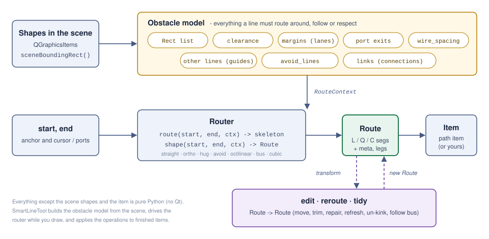

# smartline API reference

Version 0.7.1. This document describes the interactive class (`SmartLineTool`), the data
objects that describe **what a line must route around**, and the data object that **is the
line** (`Route`). Everything in sections 2-4 is pure Python and works without Qt; only
sections 1 and 6 need a Qt binding.



Coordinates are scene coordinates throughout. Two plain types are used everywhere:

| type | definition | notes |
|---|---|---|
| `Pt` | `(x, y)` tuple of floats | |
| `Rect` | `(left, top, right, bottom)` tuple | `left < right`, `top < bottom`; y grows downwards |

---

## 1. `SmartLineTool` — the smartline class

`smartline.SmartLineTool(scene, modes=None, parent=None)` — a `QObject` that attaches to any
`QGraphicsScene` as an event filter. It draws lines interactively, and it is also the
callable entry point for every operation on finished lines (re-route, un-kink, follow bus,
trim, keep connections). `modes` is a list of registry names and/or `Router` instances, in
ring order; the default is `smartline.DEFAULT_MODES`.

```python
from smartline import SmartLineTool

tool = SmartLineTool(scene, modes=["ortho", "hug", "avoid", "bus", "cubic"])
tool.clearance = 12
tool.routeFinished.connect(lambda route: print(route.to_svg()))
tool.routesRerouted.connect(lambda changes: undo_stack.push(RerouteCommand(changes)))
tool.set_active(True)
```

### 1.1 Settings (plain attributes, change at any time)

| attribute | default | meaning |
|---|---|---|
| `clearance` | `8.0` | gap kept between a line and a shape; also the length of a port stub |
| `wire_spacing` | `10.0` | distance kept between parallel lines when re-routing (`0` = off) |
| `bend_penalty` | `40.0` | `avoid` mode: px of detour one bend is worth |
| `bus_pitch` / `bus_capture` | `12.0` / `60.0` | lane spacing of bus members / auto-pick radius for the guide |
| `kink_length` | `40.0` | a section shorter than this, between two bends, is a kink |
| `tidy_reroutes` | `True` | un-kink the result of every re-route |
| `port_exits` | `True` | attached ends leave squarely and run straight for `clearance` |
| `port_tolerance` | `3.0` | how close to a shape's perimeter counts as attached |
| `grid` | `0.0` | `> 0` snaps the cursor to a grid |
| `corner_radius` | `0.0` | drawing-only fillet of polyline corners (not stored in the `Route`) |
| `shift_angle_step` | `45.0` | Shift constrains straight legs to this angle step |
| `auto_add` | `True` | add an item to the scene when a line is finished |
| `pen`, `preview_pen`, `guide_pen` | | `QPen`s for finished lines, the preview, the bus-guide highlight |
| `keymap` | `DEFAULT_KEYMAP` | chord → action dict, e.g. `tool.keymap["C"] = "mode:cubic"` |
| `routers` | | the mode ring (`List[Router]`) |

### 1.2 Hooks (callables you assign; all optional)

| hook | signature | purpose |
|---|---|---|
| `obstacle_filter` | `f(QGraphicsItem) -> bool` | which scene items are shapes (default: visible top-level items that are not lines or unfilled paths) |
| `obstacle_provider` | `f() -> Iterable[QRectF]` | replace the scene scan entirely |
| `snap_provider` | `f(QPointF) -> QPointF \| None` | ports / pins; wins over grid and lane snapping |
| `port_normal_provider` | `f(QPointF) -> (nx, ny) \| None` | outward unit normal at a port, for non-rectangular shapes |
| `guide_provider` | `f() -> Iterable[list[QPointF]]` | the existing nets, if they are not discoverable from the scene |
| `route_of` | `f(item) -> Route \| None` | where a connector item keeps its route (default: `item._smartline_route`) |
| `apply_route` | `f(item, Route)` | write a changed route into your item class (default: `setPath` + `_smartline_route`) |
| `item_factory` | `f(Route) -> QGraphicsItem` | build your own connector item when a line is finished |

Deeper customisation: subclass and override `make_item(route)`, `collect_obstacles()`,
`collect_guides()`.

### 1.3 Signals

| signal | payload | when |
|---|---|---|
| `routeFinished` | `Route` | a drawn line is finished |
| `lineFinished` | `list[QPointF]` | same, flattened |
| `legCommitted` | `Route` | one click-to-click leg was placed |
| `previewChanged` | `Route \| None` | the live preview changed |
| `modeChanged` / `postureChanged` | `str` / `bool` | |
| `cancelled` | | stroke abandoned |
| `routesRerouted` | `list[(item, old Route, new Route)]` | any operation below changed lines — **one undo batch** |

### 1.4 Drawing

`set_active(bool)`, `is_active()`, `is_drawing()`, `set_mode(name_or_index)`, `next_mode()`,
`prev_mode()`, `mode`, `router`, `toggle_posture()`, `cycle_guide()`, `undo_leg()`,
`finish(commit_live=True)`, `cancel()`, `route()` (committed so far), `points()`,
`do(action)` (run a keymap action by name).

### 1.5 Operations on finished lines

All return `[(item, old_route, new_route), ...]` (empty if nothing changed) and emit the same
list as `routesRerouted`.

| method | what it does |
|---|---|
| `reroute_around(shape, wires=None, refresh=False)` | repair the lines a shape (item or `QRectF`) overlaps. `refresh=True`: route every line *near* the shape again from scratch with the current settings |
| `reroute_colliding()` | `reroute_around` for every shape |
| `refresh_routes(items=None)` | route these lines (or all) again with the current settings |
| `shape_moved(shape, record=True)` | attached lines keep their connection and are re-routed; other overlapped lines are repaired. `record=False` = live update while dragging, nothing emitted |
| `unkink(item, max_jog=None)` | collapse short jogs, hairpins and spurs |
| `follow_bus(item, guide=None)` | re-route as a bus member of the line it runs closest to (or of `guide`) |
| `trim_end(item, which="end")` | delete the last section from an end, with the curve attached to it. `new_route` is `None` if nothing would be left |

Support: `wires()` → `[(item, Route)]`, `set_item_route(item, route)`, `router_named(name)`,
`refresh_obstacles()`, `refresh_guides()`, `obstacle_items()`, `exit_finder()`.

### 1.6 Connections

| method | meaning |
|---|---|
| `attach(item)` | find connections by geometry: an end on a shape's perimeter is attached to it. Automatic for lines the tool draws; call again after you move a line end yourself |
| `link(item, which, shape, scene_point=None)` | set a connection explicitly (`shape=None` detaches) — for applications with their own port model |
| `links(item)` | `{"start": (shape, local_point) \| None, "end": ...}` |
| `linked_wires(shape)` | `[(item, "start" \| "end"), ...]` |

---

## 2. The data that enables routing around objects

Routers never look at the scene. Everything they may avoid, follow or respect arrives in one
object, `RouteContext`; `SmartLineTool` builds it from the scene, headless callers build it
themselves.

### 2.1 Shapes: `Rect` and the clearance hull

A shape is a `Rect`. The tool uses each shape item's `sceneBoundingRect()`, which includes
half the pen width. A line keeps `clearance` away from it: the rectangle inflated by the
clearance is the shape's **hull**, and routes run *on or outside* the hull. A segment that
touches or slides along a rectangle's edge does not count as intersecting it
(`geometry.clip_segment` tests the open interior), which is what lets a line hug a hull.

`RouteContext.hulls(*endpoints)` returns the hulls to avoid, skipping any hull that contains
one of the given end points — an end inside a hull means the line starts from or arrives at
that shape. (With port exits routing happens between stub ends that lie *on* the hull, so the
line's own shape is respected too.)

### 2.2 `RouteContext`

`smartline.RouteContext(**fields)` — a dataclass; every field has a default.

| field | type / default | used by | meaning |
|---|---|---|---|
| `obstacles` | `Sequence[Rect]` / `()` | all avoiding routers | the shapes |
| `clearance` | `float` / `8.0` | all | hull inflation |
| `margins` | `Dict[Rect, float]` / `{}` | all | extra inflation per shape — how a re-route pushes a line into the next *lane* |
| `wire_spacing` | `float` / `0.0` | reroute, tidy | min distance between parallel lines |
| `avoid_lines` | `Sequence[polyline]` / `()` | `avoid` | lines whose crossing is priced in the A* search |
| `crossing_penalty` | `float` / `1000.0` | `avoid` | px of detour one crossing is worth |
| `winding` | `"auto" \| "cw" \| "ccw"` | `hug` | which way round a shape (`auto` = shorter) |
| `bend_penalty` | `float` / `40.0` | `avoid` | px of detour one bend is worth |
| `flip` | `bool` / `False` | all | posture toggle (HV↔VH, bus side, curve tangent axis) |
| `auto_posture` | `"HV" \| "VH" \| None` | `ortho`, `cubic` | posture latched from the drag direction |
| `prev_heading` | `"H" \| "V" \| None` | `ortho-alternate` | heading of the previous leg |
| `angle_step` | `float` / `0.0` | `straight` | polar snap in degrees |
| `guides` | `Sequence[polyline]` / `()` | `bus` | existing nets to choose a guide from |
| `guide` | `polyline \| None` | `bus` | explicit guide |
| `bus_pitch`, `bus_capture` | `12.0`, `60.0` | `bus` | lane spacing, auto-pick radius |
| `start_normal`, `end_normal` | `Pt \| None` | `cubic` | port normals the curve must be tangent to |
| `max_iterations` | `int` / `64` | `hug` | walkaround safety limit |

### 2.3 Port exits: `Exit`

`Exit = (stub_end: Pt, outward_normal: Pt, shape_rect: Rect)` — the description of a line end
that is attached to a shape. `stub_end` is `clearance` out from the perimeter along the
normal, i.e. exactly on the hull.

| function (`smartline.ports`) | meaning |
|---|---|
| `rect_exit_finder(rects, tol=3.0)` | returns `find(point, clearance) -> Exit \| None` |
| `shape_with_exits(router, start, end, ctx, exit_a=None, exit_b=None) -> Route` | route between the stub ends, then put the square stubs back on |
| `stubs_ok(flat, clearance, exit_a, exit_b) -> bool` | are the attached ends still square and full length? |
| `obstacle_intrusion(flat, rects, exit_a, exit_b) -> float` | length of the line inside shapes — what a re-route minimises first |
| `geometry.port_exit(p, rects, clearance, tol=3.0) -> Exit \| None` | the underlying test |

### 2.4 Other lines

Other lines enter as flattened polylines (`route.flatten()`): as `ctx.guides` for `bus`, as
`ctx.avoid_lines` for `avoid`, and as the `others` argument of `reroute.repair`,
`reroute.refresh`, `tidy.unkink` and `tidy.follow`. Relevant measures in `smartline.geometry`:
`overlap_length(a, b, tol)` (shared track; crossings do not count), `crossings(a, b)`,
`length_inside(pts, rect)`.

### 2.5 Priorities of a re-route

1. no part of the line inside a shape (measured as length, over all shapes);
2. no collision with another line — never on top of one, then as few crossings as possible;
3. the natural way round, the innermost lane, the posture it was drawn with, then length.

---

## 3. The line itself: `Route`

`smartline.Route(start, segs=[], meta={})` is the single result type: a router *produces* one,
the editor and the `edit` / `reroute` / `tidy` functions *transform* one (always returning a
new `Route`), and an item *stores* one. It is an SVG-path-like chain in scene coordinates.

### 3.1 `Seg`

`Seg(cmd, pts)` — frozen dataclass.

| `cmd` | `pts` | meaning |
|---|---|---|
| `"L"` | `(end,)` | straight line |
| `"Q"` | `(ctrl, end)` | quadratic Bézier |
| `"C"` | `(ctrl1, ctrl2, end)` | cubic Bézier |

`seg.end` is the last point. A segment starts where the previous one ended.

### 3.2 Fields and construction

| member | meaning |
|---|---|
| `start: Pt` | first point |
| `segs: List[Seg]` | the chain |
| `meta: Dict[str, Any]` | provenance and status, see 3.4 |
| `Route.from_points(pts, **meta)` | polyline → Route |
| `Route.coerce(value)` | accepts a `Route` or a point list |
| `line_to(p)`, `quad_to(c, p)`, `cubic_to(c1, c2, p)` | append a segment (chainable) |
| `joined(other)` | concatenation; merges leg provenance |

### 3.3 Views

| view | returns | for |
|---|---|---|
| `end`, `is_polyline` | `Pt`, `bool` | |
| `anchors()` | on-curve vertices | node editing |
| `flatten(tolerance=0.5)` | polyline approximation | hit-testing, obstacles, bus guides |
| `to_segments(tolerance=0.5)` | `[(p0, p1), ...]` | KiCad wires, netlists |
| `to_nodes(normalize=False, hv=False)` | `[{"cmd","x","y", "c1x","c1y","c2x","c2y" \| "cx","cy"}, ...]` | PictoSync curve nodes, JSON. `normalize`: 0–1 within `bbox()`; `hv`: axis-aligned lines as `H`/`V` |
| `to_svg(digits=2)` | `"M 0 0 L 10 0 C ..."` | SVG, logging |
| `bbox()` | `(left, top, right, bottom)` of the control polygon | |
| `legs()` | see 3.4 | re-routing |

```python
r = Route((0, 0)).line_to((50, 0)).cubic_to((80, 0), (100, 20), (100, 50))
r.to_nodes()
# [{'cmd': 'M', 'x': 0, 'y': 0}, {'cmd': 'L', 'x': 50, 'y': 0},
#  {'cmd': 'C', 'x': 100, 'y': 50, 'c1x': 80, 'c1y': 0, 'c2x': 100, 'c2y': 20}]
```

### 3.4 `meta`

| key | set by | meaning |
|---|---|---|
| `router`, `flip`, `posture` | tool / routers | the mode, posture flip and latched posture the line was drawn with |
| `legs` | `joined()` | `[{"router","flip","posture","end": Pt}, ...]` — one record per click-to-click leg. `legs()` returns this, or a single record built from the keys above. It is what lets a re-route repair each part with the method it was drawn with |
| `unresolved` | reroute | `True`: still inside a shape (typically an end lies within it) |
| `overlaps` | reroute | px of track still shared with another line |
| `crossings` | reroute | number of other lines still crossed |

### 3.5 The item contract

smartline does not own your connector item class. By default a connector is a
`QGraphicsPathItem` carrying two attributes:

| attribute | type | meaning |
|---|---|---|
| `item._smartline_route` | `Route` | the line (scene coordinates). Read through `tool.route_of` / `editor.route_of`, written through `tool.apply_route` / `editor.apply` |
| `item._smartline_links` | `{"start": (shape_item, QPointF local) \| None, "end": ...}` | connections; the point is in the *shape's* coordinates so it follows the shape |

Keep wire items **unfilled** (the default scan treats unfilled paths and `QGraphicsLineItem`s
as lines, everything else as a shape), give them a widened `shape()` so they can be clicked,
and on PySide keep Python references to items you add to a scene.

---

## 4. Routers and the pure-Python operations

### 4.1 `Router`

| member | meaning |
|---|---|
| `name`, `label`, `free_angle` | registry key, display name, may segments take any direction |
| `route(start, end, ctx) -> List[Pt]` | the *skeleton* polyline (required) |
| `shape(start, end, ctx) -> Route` | the drawn geometry; defaults to the skeleton as lines |
| `constrain_start(start, ctx)`, `constrain_end(start, end, ctx)` | snap hooks |
| `avoiding() -> Router` | the obstacle-respecting version (default: wrapped in a walkaround) |

Built-ins (`smartline.available()`): `straight`, `ortho`, `ortho-alternate`, `hug`,
`hug-straight`, `avoid`, `octilinear`, `bus`, `cubic`, `cubic-hug`. Registry:
`register` (decorator or `register(name, factory)`, `replace=True` to override a built-in),
`create(name)`, `available()`, `default_routers(modes)`, entry-point group `smartline.routers`.

### 4.2 Operations (`Route -> Route`)

| module | functions |
|---|---|
| `smartline.edit` | `handles`, `nearest_segment`, `is_orthogonal`, `move_anchor`, `move_segment`, `move_control`, `insert_anchor`, `delete_anchor`, `convert_segment`, `end_span`, `trim_end`, `span_points`, `normalize` |
| `smartline.reroute` | `hits`, `hit_segments`, `near`, `repair(route, rect, ctx, lookup, others=…)`, `refresh(route, ctx, lookup, others=…)`, `leg_at`, `leg_span` |
| `smartline.tidy` | `kinks`, `unkink(route, ctx, max_jog, others)`, `nearest_route(route, others)`, `follow(route, guide, ctx, others)` |

---

## 5. Headless example

```python
from smartline import RouteContext, create, ports, reroute

shapes = [(100, 100, 200, 200), (400, 300, 500, 400)]
ctx = RouteContext(obstacles=shapes, clearance=12, wire_spacing=10)
find = ports.rect_exit_finder(shapes)
a, b = (200, 150), (400, 350)                       # ports on the two shapes

line = ports.shape_with_exits(create("hug"), a, b, ctx, find(a, 12), find(b, 12))
line.meta.update(router="hug", flip=False, posture=None)
line.to_svg(0)        # 'M 200 150 L 212 150 L 388 150 L 388 350 L 400 350'

blocker = (260, 120, 340, 260)                      # a shape dropped onto the line
ctx = RouteContext(obstacles=shapes + [blocker], clearance=12, wire_spacing=10)
fixed = reroute.repair(line, blocker, ctx)
fixed.to_svg(0)       # 'M 200 150 L 248 150 L 248 108 L 352 108 L 352 150 L 388 150 L 388 350 L 400 350'
```

## 6. `RouteEditor` (summary)

`smartline.RouteEditor(scene)` — select-and-reshape editor, also an event filter.
`set_active`, `edit(item, route=None)`, `stop`, `refresh`, `route`, `item`, `set_route(route,
record=True)`, `delete_hot_anchor`, `select_end`, `selected_end`, `trim_end`. Attributes:
`follow_selection`, `grid`, `corner_radius`, `keep_orthogonal`, `link` (`aligned` / `mirrored`
/ `free`), `snap_provider`, `route_of`, `apply`. Signals: `editingStarted(item)`,
`editingStopped(item)`, `routeChanged(item, Route)`, `routeEdited(item, old, new)`,
`removalRequested(item)`.
